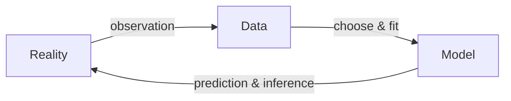

# Probability and Statistics

Life is uncertain, and so is nature. Probability enables us to quantify about such uncertainties  and reason about them. By modeling such uncertain phenomena or behaviors, probability allows us to make predictions of likelihood of future events. While modeling such phenomena, many parameters are uncertain and unknown to us. In order to learn about the parameters that describe the nature, we need to collect data from the real-world. Statistics provides us with techniques to collect, analyze and interpret past numerical data from some samples to inferring (estimate) the parameters representative of the whole data. Furthermore, probability allows to study the intrinsic randomness of many such naturally stochastic phenomena, while statistics allows to infer the model's parameters, as well as understanding underlying process that explains the data.

Humans have been counting since the Paleolithic or the stone age, where our ancestors ([35,000 years ago](https://en.wikipedia.org/wiki/Tally_marks)) used some form of tally marks to count and keep track of quantities. The ancient civilization such as the Babylonians conducted census to count people, livestock and quantities. However, the idea became more popular and systematic during Renaissance in the Italian city-states of Venice and Florence. The term statistics got its name from German 'statistik' which came from Latin "statisticum" meaning state affairs. The idea spread through Europe and it became required to register birth, marriage and death. Reportings of mortality due to war, epidemic diseases, famines were popular in 1600s and later accounted for all causes of death. In this regard [John Graunt's Natural and Political Observations on the Bills of Mortality](https://doi.org/10.2307/2982578) is considered as a first attempt to draw scientific conclusion from statistical data, such as calculating the population of london using the average deaths by surveying household in certain London neighborhoods. Later it became popular as numerical science for other purposes as well but only in 1800s it started evolving as inferential tool with development of regression, correlation analysis and t-test.

[Descriptive Statistics](./DescriptiveStats.ipynb)

Before probability theory was formalized, humans already observed uncertain events like rolling dice, rainfall patterns, trade risks. The key insight behind probability distributions is:

> Even though individual outcomes are uncertain, the pattern of outcomes often follows a stable, predictable structure.

For example you cannot predict a single fair coin flip, but you can predict that in 10,000 flips roughly 5,000 will be heads. Most of the early probability theory emerged from gambling problems.

[Random Variables and Random Process](./RandomVariables.ipynb)

## Probabilistic  

A probabilistic space that models random process consists of three important elements:

1. Sample Space $$\omega$$: A set of all possible outcomes of an experiment, where the outcomes are 
  - mutually exclusive (if this happens, that doesn't occur),
  - collectively exhaustive (all possible outcomes are included, anything outside $$\omega$$ is not possible) and 
  - are at right granularity (right level of details are accounted for, i.e without irrelevant information).
2. Event Space $$E$$: A collection of events, where each event is a subset of sample space 
3. Probability Distribution (function or measure) $$P:E \rightarrow \mathbb R$$: A function $$P(\cdot)$$ that takes in an event and returns a real number between [0,1] indicating the chance of the event occurring. This follows certain probabilistic laws or axioms to assign probability to outcomes:
  - Non-Negativity: $$P(E) \geq 0$$: also implies $$P(\emptyset) = 0$$
  - Normalization: $$P(\omega) = 1$$ : $$\omega$$ is collectively exhaustive.
  - Finite Additivity: For two disjoint events (i.e. $A \cap B = \emptyset$): $$P(A \cup B) = P(A) + P(B)$$
    - Extends to a set of mutually exclusive events: $P(E_1 \cup E_2 \cup \dots E_n) = P(E_1) + P(E_2) + \dots + P(E_n)$
    - Defines compliments with normalization: $P(\omega) = P(E) + P(E^c) = 1, \quad \therefore P(E^c) = 1 - P(E) $
  - Conditional Probability for overlapping events $$P(A | B) = \frac{P(A \cap B)}{P(B)}$$ defines 
    - Multiplication rule of probability or composite probability: $P(A \cap B) = P(A|B) \times P(B) = P(B|A) \times P(A)$ 
    - Generalize Total Probability Theorem: $P(B) = P(B \cap A) + P(B \cap A^c)$, this allows to partition the sample space as weighted average of probabilities of an Event i.e $P(B) = P(A_1) \times P(B|A_1) + P(A_2) \times P(B|A_2) + \dots P(A_n) \times P(B|A_n)$
    - Bayes Rule $P(H|E) = \frac{P(E|H)P(H)}{P(E)}$ allows to evaluate posterior (revised belief about hypothesis H given evidence E has occurred) with prior beliefs (Probability that hypothesis H has occurred), likelihood of evidence E occurring given hypothesis marginalized by the probability of Evidence being true
  - independent events $P(B|A) = P(B)$ i.e occurrence of A provides no information about occurrence of B. Note: Disjoint events are dependent events i.e if A has occurred implies that event $P(B|A)=0$
    - dependent: $P(A \cap B) = P(A) P(B|A)$,
    - independent: $P(A \cap B) = P(A) P(B)

## Statistics

In probability, we have general rules and a single way of evaluating, leading to unique answers, but in statistical questions, there may not be a unique answers. Different statistical methods have different desirable properties leading to different answers. Often times misuse of methods for a particular situation could lead to erroneous answers.

- Classical Statistics : Parameter estimation without Priors
  - Maximum Likelihood Estimation (MLE)
  - Estimating Sample Mean
  - Confidence Intervals (CIs) around the estimate
- Bayesian Statistics

## Information Theory

- KL Divergence
- Cross Entropy
- Shannon Entropy

## Sampling

- Candidate Sampling
- Negative Sampling
- Monte Carlo Method
- Markov Chain
- MCMC
- Gibbs

## References

- Course: [MIT 6.041 Probabilistic System Analysis and Applied Probability](https://ocw.mit.edu/courses/6-041-probabilistic-systems-analysis-and-applied-probability-fall-2010)
- Book: Introduction to Probability by Dimitri P. Bertsekas and John N. Tsitsiklis
- [Statistics with Julia: Book & Code](https://statisticswithjulia.org/)
